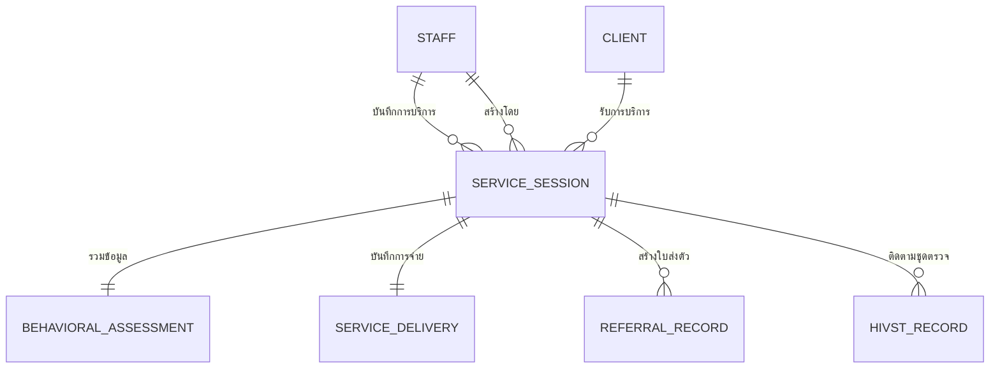

# เอกสารสรุปโครงการพัฒนาระบบจัดการข้อมูลผู้รับบริการ (Diamond Friend)

เอกสารฉบับนี้รวบรวมข้อมูลการวิเคราะห์ระบบ ข้อกำหนดทางเทคนิค การออกแบบฐานข้อมูล และแผนการดำเนินงาน สำหรับโครงการพัฒนาระบบดิจิทัลของ **Diamond Friend** เพื่อยกระดับการจัดการข้อมูลจากรูปแบบกระดาษสู่ระบบที่มีประสิทธิภาพและปลอดภัย

---

## 1. บทนำและวัตถุประสงค์ (Executive Summary)

ปัจจุบันการเก็บข้อมูลผ่านกระดาษ (Paper-based) มีความเสี่ยงต่อการสูญหาย การเข้าถึงข้อมูลที่ล่าช้า และความปลอดภัยของข้อมูลส่วนบุคคล โครงการนี้จึงมีเป้าหมายเพื่อเปลี่ยนกระบวนการทำงานสู่ระบบดิจิทัล (Digital Transformation) โดยมุ่งเน้นที่:
*   **Data Accuracy:** ความถูกต้องและแม่นยำของข้อมูลผ่านระบบ Validation
*   **Accessibility:** การเข้าถึงข้อมูลได้จากทุกที่ (Mobile/Field Work)
*   **Security & Privacy:** การคุ้มครองข้อมูลส่วนบุคคลที่มีความอ่อนไหวตามมาตรฐาน PDPA

---

## 2. การวิเคราะห์คุณค่าทางธุรกิจ (Business Value Analysis)

| หัวข้อ | ปัญหาปัจจุบัน (Pain Points) | สิ่งที่ระบบใหม่จะส่งมอบ (Solution Value) |
| :--- | :--- | :--- |
| **การทำงานหน้างาน** | การจดบันทึกลงกระดาษขณะออกหน่วยเคลื่อนที่ทำได้ยากและซ้ำซ้อน | ระบบ Responsive รองรับ Tablet/iPad บันทึกข้อมูลได้ทันทีแบบ Real-time |
| **ความปลอดภัย** | ข้อมูลความลับ (ผลตรวจ/พฤติกรรมเสี่ยง) อาจถูกเปิดเผยได้ง่าย | ระบบ Role-based Access Control (RBAC) จำกัดสิทธิ์การเห็นข้อมูลเฉพาะผู้ที่เกี่ยวข้อง |
| **การติดตามผล** | การติดตามผลการส่งตัว (Referral) ทำได้ยากและขาดความต่อเนื่อง | ระบบ Dashboard ติดตามสถานะการส่งต่อและแจ้งเตือนผลตรวจที่ยังไม่ได้รับการอัปเดต |
| **การรายงานผล** | ต้องเสียเวลาสรุปผลรายงานรายเดือนด้วยมือ | ระบบสามารถ Export รายงานและสรุปผลเชิงสถิติได้ทันที |

---

## 3. โมดูลหลักของระบบ (System Modules)

ระบบประกอบด้วย 6 โมดูลการทำงานหลัก ได้แก่:

1.  **ระบบจัดการผู้ใช้งาน (User Management):** จัดการบัญชีเจ้าหน้าที่และสิทธิ์การเข้าถึง (RBAC)
2.  **ระบบจัดการข้อมูลผู้รับบริการ (Client Management):** ลงทะเบียนและเก็บประวัติประชากรของผู้รับบริการ (Single Source of Truth)
3.  **ระบบจัดการรอบการบริการ (Service Session):** บันทึกข้อมูลการปฏิบัติงานในแต่ละครั้ง (Mobile Clinic, Outreach, Drop-in)
4.  **ระบบประเมินและจ่ายเวชภัณฑ์ (Assessment & Delivery):** บันทึกการประเมินพฤติกรรมเสี่ยงและจำนวนถุงยาง/สารหล่อลื่นที่แจก
5.  **ระบบจัดการการส่งต่อ (Referral Management):** สร้างใบส่งตัวไปตรวจ (HIV, STIs, TB) และติดตามผลการตรวจจากโรงพยาบาล
6.  **ระบบติดตามการตรวจ HIVST (HIVST Tracking):** ติดตามการแจกและผลการตรวจด้วยตนเอง

---

## 4. บทบาทผู้ใช้งาน (User Roles & Actors)

1.  **Volunteer (อาสาสมัคร):** บันทึกข้อมูลพื้นฐานหน้างานและการจ่ายเวชภัณฑ์
2.  **Staff / Health Worker (เจ้าหน้าที่):** ผู้ใช้งานหลัก บันทึกข้อมูลสุขภาพ การประเมิน และการส่งต่อ
3.  **Supervisor (หัวหน้างาน):** ตรวจสอบคุณภาพข้อมูล ติดตามผล และดูรายงานสรุป
4.  **Administrator (ผู้ดูแลระบบ):** จัดการผู้ใช้งานและตั้งค่าโครงสร้างระบบ

> **หมายเหตุสำคัญ:** ผู้รับบริการ (Client) คือ "หัวเรื่องของข้อมูล" แต่ไม่ใช่ "ผู้ใช้งานระบบ" ในเวอร์ชันนี้ เพื่อความปลอดภัยสูงสุดของข้อมูลสุขภาพที่อ่อนไหวตามมาตรฐาน PDPA

---

## 5. ข้อกำหนดของระบบ (System Requirements)

### 5.1 ข้อกำหนดทางฟังก์ชัน (Functional Requirements)
*   **FR-01:** ระบบต้องยืนยันตัวตนก่อนใช้งานทุกครั้ง
*   **FR-02:** ป้องกันการลงทะเบียนผู้รับบริการซ้ำด้วยเลขบัตรประชาชน
*   **FR-03:** ข้อมูลการประเมินและการแจกของต้องเชื่อมโยงกับ "รอบการบริการ (Session)" เสมอ
*   **FR-04:** รองรับ Unified Workflow (กรอกข้อมูลครบจบในหน้าเดียว)
*   **FR-05:** ผู้ใช้ต้องสามารถสร้างรายการส่งต่อระหว่างรอบการบริการ และกลับมาอัปเดต "ผลการตรวจ" ได้ในภายหลัง
*   **FR-06:** บันทึกประวัติการแก้ไขข้อมูล (Audit Logging) โดยอัตโนมัติ

### 5.2 ข้อกำหนดที่ไม่ใช่ฟังก์ชัน (Non-Functional Requirements)
*   **NFR-01 (Security):** ข้อมูลสุขภาพต้องได้รับสิทธิ์เข้าถึงตามบทบาท (RBAC) อย่างเคร่งครัด
*   **NFR-02 (Responsive):** หน้าจอต้องใช้งานได้ดีทั้งบนคอมพิวเตอร์และแท็บเล็ต (สำหรับงาน Mobile Clinic)
*   **NFR-03 (Data Integrity):** บังคับใช้ Foreign Keys และการตรวจสอบความถูกต้องของข้อมูลนำเข้า
*   **NFR-04 (Performance):** บันทึก Log ทุกครั้งที่มีการเข้าดูหรือแก้ไขข้อมูล (Audit Trail)

---

## 6. รายละเอียดพฤติกรรมการใช้งาน (Use Case Specification)

| UC ID | ชื่อยูสเคส | Volunteer | Staff | Supervisor | Admin |
| :--- | :--- | :---: | :---: | :---: | :---: |
| **UC-01** | เข้าสู่ระบบ / ออกจากระบบ | ✓ | ✓ | ✓ | ✓ |
| **UC-02** | จัดการบัญชีผู้ใช้งาน | - | - | - | ✓ |
| **UC-03** | จัดการตั้งค่าระบบ (แหล่งทุน/คู่ความร่วมมือ) | - | - | - | ✓ |
| **UC-04** | ลงทะเบียน/แก้ไขข้อมูลผู้รับบริการ | - | ✓ | - | - |
| **UC-05** | ค้นหาและดูประวัติผู้รับบริการ | - | ✓ | ✓ | - |
| **UC-06** | สร้างรอบการรับบริการ (Service Session) | ✓ | ✓ | - | - |
| **UC-07** | บันทึกการจ่ายเวชภัณฑ์และถุงยาง | ✓ | ✓ | - | - |
| **UC-08** | บันทึกการประเมินพฤติกรรมเสี่ยง | - | ✓ | - | - |
| **UC-09** | จัดการการส่งตัวไปตรวจ (Referral) | - | ✓ | - | - |
| **UC-10** | อัปเดตผลการตรวจ | - | ✓ | ✓ | - |
| **UC-11** | ติดตามการแจกชุดตรวจ HIVST | - | ✓ | - | - |
| **UC-12** | ดูแดชบอร์ดและรายงานสถิติ | - | - | ✓ | ✓ |
| **UC-13** | ตรวจสอบความถูกต้องของข้อมูล (Audit) | - | - | ✓ | - |

---

## 7. โครงสร้างฐานข้อมูล (Data Architecture)

### 7.1 แผนภาพความสัมพันธ์ (ER Diagram)

### 7.2 พจนานุกรมข้อมูล (Data Dictionary)

#### 1) ตาราง CLIENT (ข้อมูลผู้รับบริการ)
| ชื่อฟิลด์ | ประเภทข้อมูล | Key | คำอธิบาย |
| :--- | :--- | :---: | :--- |
| client_id | string | PK | รหัสผู้รับบริการ |
| full_name | string | | ชื่อ-นามสกุล |
| nickname | string | | ชื่อเล่น |
| id_card_number | string | | เลขบัตรประชาชน |
| birth_date | date | | วันเกิด |
| nationality | string | | สัญชาติ |
| birth_gender | string | | เพศโดยกำเนิด |
| phone_number | string | | เบอร์โทรศัพท์ |
| line_id | string | | Line ID |
| address | string | | ที่อยู่ |
| education_level | string | | ระดับการศึกษา |
| occupation | string | | อาชีพ |
| income_range | string | | รายได้เฉลี่ย |
| health_insurance | string | | สิทธิการรักษา |
| target_group | string | | กลุ่มเป้าหมาย |
| created_at | datetime | | สร้างเมื่อ |
| updated_at | datetime | | แก้ไขเมื่อ |

#### 2) ตาราง STAFF (เจ้าหน้าที่/ผู้ใช้งาน)
| ชื่อฟิลด์ | ประเภทข้อมูล | Key | คำอธิบาย |
| :--- | :--- | :---: | :--- |
| staff_id | string | PK | รหัสเจ้าหน้าที่ |
| username | string | | ชื่อผู้ใช้ |
| password_hash | string | | รหัสผ่านที่เข้ารหัส |
| staff_name | string | | ชื่อ-นามสกุลเจ้าหน้าที่ |
| role | string | | บทบาท (Admin, Supervisor, Staff, Volunteer) |
| email | string | | อีเมล |
| phone_number | string | | เบอร์โทรศัพท์ |
| is_active | boolean | | สถานะการใช้งาน |
| last_login | datetime | | เข้าสู่ระบบล่าสุด |
| created_at | datetime | | สร้างเมื่อ |

#### 3) ตาราง SERVICE_SESSION (รอบการรับบริการ)
| ชื่อฟิลด์ | ประเภทข้อมูล | Key | คำอธิบาย |
| :--- | :--- | :---: | :--- |
| session_id | int | PK | รหัสรอบการบริการ |
| client_id | string | FK | รหัสผู้รับบริการ |
| staff_id | string | FK | เจ้าหน้าที่ผู้ให้บริการ |
| created_by | string | FK | เจ้าหน้าที่ผู้บันทึกข้อมูล |
| service_date | date | | วันที่รับบริการ |
| access_channel | string | | ช่องทางการเข้าถึง |
| service_province | string | | จังหวัดที่ให้บริการ |
| service_district | string | | อำเภอที่ให้บริการ |
| is_mobile_clinic | boolean | | ออกหน่วยเคลื่อนที่ |
| partner_agency | string | | หน่วยงานร่วม |
| funding_source | string | | แหล่งงบประมาณ |
| created_at | datetime | | สร้างเมื่อ |
| updated_at | datetime | | แก้ไขเมื่อ |

#### 4) ตาราง BEHAVIORAL_ASSESSMENT (การประเมินพฤติกรรมเสี่ยง)
| ชื่อฟิลด์ | ประเภทข้อมูล | Key | คำอธิบาย |
| :--- | :--- | :---: | :--- |
| session_id | int | PK, FK | รหัสรอบการบริการ |
| partner_type_3m | string | | ประเภทคู่นอน (3 เดือน) |
| last_sex_method | string | | วิธีมีเพศสัมพันธ์ล่าสุด |
| condom_use_freq | string | | ความถี่การใช้ถุงยาง |
| chemsex_history | boolean | | ประวัติ Chemsex |
| needle_sharing | boolean | | การใช้เข็มร่วมกัน |
| last_hiv_test_result | string | | ผลตรวจ HIV ล่าสุด |
| art_status | string | | สถานะการรับยา ART |
| disclosure_status | string | | สถานะการเปิดเผยผล |

#### 5) ตาราง SERVICE_DELIVERY (บันทึกการจ่ายเวชภัณฑ์)
| ชื่อฟิลด์ | ประเภทข้อมูล | Key | คำอธิบาย |
| :--- | :--- | :---: | :--- |
| session_id | int | PK, FK | รหัสรอบการบริการ |
| edu_hiv_stis | boolean | | ความรู้ HIV/STIs |
| edu_prep_pep | boolean | | ความรู้ PrEP/PEP |
| condom_49mm_qty | int | | ถุงยาง 49มม. (ชิ้น) |
| condom_52mm_qty | int | | ถุงยาง 52มม. (ชิ้น) |
| lubricant_qty | int | | สารหล่อลื่น (ซอง) |
| syringe_qty | int | | เข็มฉีดยา (ชิ้น) |

#### 6) ตาราง REFERRAL_RECORD (บันทึกการส่งต่อ)
| ชื่อฟิลด์ | ประเภทข้อมูล | Key | คำอธิบาย |
| :--- | :--- | :---: | :--- |
| referral_id | int | PK | รหัสการส่งต่อ |
| session_id | int | FK | รหัสรอบการบริการ |
| referral_type | string | | ประเภทการส่งตรวจ |
| destination_hospital | string | | โรงพยาบาลที่ส่งไป |
| test_date | date | | วันที่ตรวจ |
| test_result | string | | ผลการตรวจ |

#### 7) ตาราง HIVST_RECORD (บันทึกชุดตรวจด้วยตนเอง)
| ชื่อฟิลด์ | ประเภทข้อมูล | Key | คำอธิบาย |
| :--- | :--- | :---: | :--- |
| session_id | int | PK, FK | รหัสรอบการบริการ |
| test_date | date | | วันที่ตรวจ |
| distribution_channel | string | | ช่องทางการรับชุดตรวจ |
| result | string | | ผลการตรวจเบื้องต้น |
| confirmed_test_link | string | | ลิงก์ยืนยันผล |

---

## 8. มาตรการความปลอดภัยและ PDPA

*   **Role-Based Access Control (RBAC):** จำกัดสิทธิ์การเห็นข้อมูลเฉพาะผู้ที่เกี่ยวข้อง อาสาสมัครจะไม่เห็นข้อมูลผลตรวจและพฤติกรรมเสี่ยงเชิงลึก
*   **Data Encryption:** เข้ารหัสรหัสผ่านและข้อมูลสำคัญในฐานข้อมูล
*   **Audit Trail:** บันทึก Log ทุกครั้งที่มีการเข้าดูหรือแก้ไขข้อมูล (ใคร, ทำอะไร, เมื่อไหร่)
*   **Data Minimization:** หน้าจอจะแสดงผลเฉพาะข้อมูลที่จำเป็นตามบทบาทของผู้ใช้งานเท่านั้น

---

## 9. แผนการดำเนินงาน (Implementation Roadmap)

1.  **Phase 1: Foundation (2-4 สัปดาห์)**
    *   ตั้งฐานข้อมูลตาม ERD ที่ออกแบบไว้
    *   พัฒนาระบบ Login และจัดการบทบาทผู้ใช้
2.  **Phase 2: Core Workflow (4-6 สัปดาห์)**
    *   พัฒนาระบบลงทะเบียนผู้รับบริการ (Client Registration)
    *   พัฒนาระบบบันทึกการบริการและแบบประเมินพฤติกรรมเสี่ยง
3.  **Phase 3: Extended Services (3-5 สัปดาห์)**
    *   ระบบจัดการการส่งต่อ (Referral) และการติดตามชุดตรวจ HIVST
    *   ระบบรายงานและ Dashboard เบื้องต้น
4.  **Phase 4: Deployment & Training (2-3 สัปดาห์)**
    *   ทดสอบระบบ (UAT) ร่วมกับผู้ใช้งานจริง
    *   อบรมเจ้าหน้าที่และการนำข้อมูลเข้าระบบ (Data Migration)

---

## 10. สรุปผล (Conclusion)

การนำระบบดิจิทัลนี้มาใช้ ไม่ใช่เพียงแค่การเปลี่ยนจากกระดาษเป็นคอมพิวเตอร์ แต่เป็นการสร้าง **"ระบบนิเวศข้อมูล" (Data Ecosystem)** ที่จะช่วยให้ Diamond Friend สามารถยกระดับคุณภาพการบริการผู้รับบริการได้อย่างยั่งยืน แม่นยำ และปลอดภัยที่สุด
