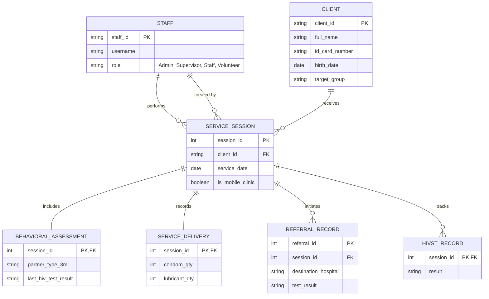

# ระบบจัดการข้อมูลผู้รับบริการ Diamond Friend (Project Documentation)

ยินดีต้อนรับสู่เอกสารสรุปโครงการพัฒนาระบบดิจิทัลสำหรับ **Diamond Friend** เพื่อยกระดับการเก็บข้อมูลจากรูปแบบกระดาษสู่ระบบจัดการข้อมูลที่มีประสิทธิภาพ ปลอดภัย และแม่นยำ

---

## 1. บทนำและวัตถุประสงค์ (Executive Summary)
ปัจจุบันการเก็บข้อมูลผ่านกระดาษ (Paper-based) มีความเสี่ยงต่อการสูญหาย การเข้าถึงข้อมูลที่ล่าช้า และความปลอดภัยของข้อมูลส่วนบุคคล โครงการนี้จึงมีเป้าหมายเพื่อเปลี่ยนกระบวนการทำงานสู่ระบบดิจิทัล (Digital Transformation) โดยมุ่งเน้นที่:
*   **Data Accuracy:** ความถูกต้องและแม่นยำของข้อมูลผ่านระบบ Validation
*   **Accessibility:** การเข้าถึงข้อมูลได้จากทุกที่ (Mobile/Field Work)
*   **Security & Privacy:** การคุ้มครองข้อมูลส่วนบุคคลที่มีความอ่อนไหวตามมาตรฐาน PDPA

---

## 2. โมดูลหลักของระบบ (System Modules)
ระบบประกอบด้วย 6 โมดูลการทำงานหลัก ได้แก่:

1.  **ระบบจัดการผู้ใช้งาน (User Management):** จัดการบัญชีเจ้าหน้าที่และสิทธิ์การเข้าถึง (RBAC)
2.  **ระบบจัดการข้อมูลผู้รับบริการ (Client Management):** ลงทะเบียนและเก็บประวัติประชากรของผู้รับบริการ (Single Source of Truth)
3.  **ระบบจัดการรอบการบริการ (Service Session):** บันทึกข้อมูลการปฏิบัติงานในแต่ละครั้ง (Mobile Clinic, Outreach, Drop-in)
4.  **ระบบประเมินและจ่ายเวชภัณฑ์ (Assessment & Delivery):** บันทึกการประเมินพฤติกรรมเสี่ยงและจำนวนถุงยาง/สารหล่อลื่นที่แจก
5.  **ระบบจัดการการส่งต่อ (Referral Management):** สร้างใบส่งตัวไปตรวจ (HIV, STIs, TB) และติดตามผลการตรวจจากโรงพยาบาล
6.  **ระบบติดตามการตรวจ HIVST (HIVST Tracking):** ติดตามการแจกและผลการตรวจด้วยตนเอง

---

## 3. บทบาทผู้ใช้งาน (User Roles & Actors)

1.  **Volunteer (อาสาสมัคร):** บันทึกข้อมูลพื้นฐานหน้างานและการจ่ายเวชภัณฑ์
2.  **Staff / Health Worker (เจ้าหน้าที่):** ผู้ใช้งานหลัก บันทึกข้อมูลสุขภาพ การประเมิน และการส่งต่อ
3.  **Supervisor (หัวหน้างาน):** ตรวจสอบคุณภาพข้อมูล ติดตามผล และดูรายงานสรุป
4.  **Administrator (ผู้ดูแลระบบ):** จัดการผู้ใช้งานและตั้งค่าโครงสร้างระบบ

> **หมายเหตุสำคัญ:** ผู้รับบริการ (Client) คือ "หัวเรื่องของข้อมูล" แต่ไม่ใช่ "ผู้ใช้งานระบบ" ในเวอร์ชันนี้ เพื่อความปลอดภัยสูงสุดของข้อมูลสุขภาพที่อ่อนไหวตามมาตรฐาน PDPA

---

## 4. ข้อกำหนดของระบบ (System Requirements)

### ข้อกำหนดทางฟังก์ชัน (Functional Requirements)
*   **FR-01:** ระบบต้องยืนยันตัวตนก่อนใช้งานทุกครั้ง
*   **FR-02:** ป้องกันการลงทะเบียนผู้รับบริการซ้ำด้วยเลขบัตรประชาชน
*   **FR-03:** ข้อมูลการประเมินและการแจกของต้องเชื่อมโยงกับ "รอบการบริการ (Session)" เสมอ
*   **FR-04:** รองรับ Unified Workflow (กรอกข้อมูลครบจบในหน้าเดียว)
*   **FR-05:** บันทึกประวัติการแก้ไขข้อมูล (Audit Logging) โดยอัตโนมัติ

### ข้อกำหนดที่ไม่ใช่ฟังก์ชัน (Non-Functional Requirements)
*   **NFR-01 (Security):** ข้อมูลสุขภาพต้องได้รับสิทธิ์เข้าถึงตามบทบาท (RBAC) อย่างเคร่งครัด
*   **NFR-02 (Responsive):** หน้าจอต้องใช้งานได้ดีทั้งบนคอมพิวเตอร์และแท็บเล็ต (สำหรับงาน Mobile Clinic)
*   **NFR-03 (Data Integrity):** บังคับใช้ Foreign Keys และการตรวจสอบความถูกต้องของข้อมูลนำเข้า

---

## 5. แผนภาพความสัมพันธ์ของข้อมูล (ER Diagram)

---

## 6. แผนการดำเนินงาน (Implementation Roadmap)

1.  **Phase 1: Foundation (2-4 สัปดาห์):** ตั้งฐานข้อมูลและระบบจัดการสิทธิ์ผู้ใช้
2.  **Phase 2: Core Workflow (4-6 สัปดาห์):** ระบบลงทะเบียนและบันทึกการบริการ/ประเมินความเสี่ยง
3.  **Phase 3: Extended Services (3-5 สัปดาห์):** ระบบส่งต่อ (Referral) และ Dashboard สรุปผล
4.  **Phase 4: Deployment & Training (2-3 สัปดาห์):** ทดสอบระบบ (UAT) และอบรมเจ้าหน้าที่

---

## 7. มาตรการความปลอดภัยและ PDPA
*   **Data Encryption:** เข้ารหัสรหัสผ่านและข้อมูลสำคัญ
*   **Audit Trail:** บันทึกทุกกิจกรรมการเข้าถึงข้อมูล (ใคร, ทำอะไร, เมื่อไหร่)
*   **Role-Based Access:** อาสาสมัครจะไม่เห็นข้อมูลผลตรวจและพฤติกรรมเสี่ยงเชิงลึก
