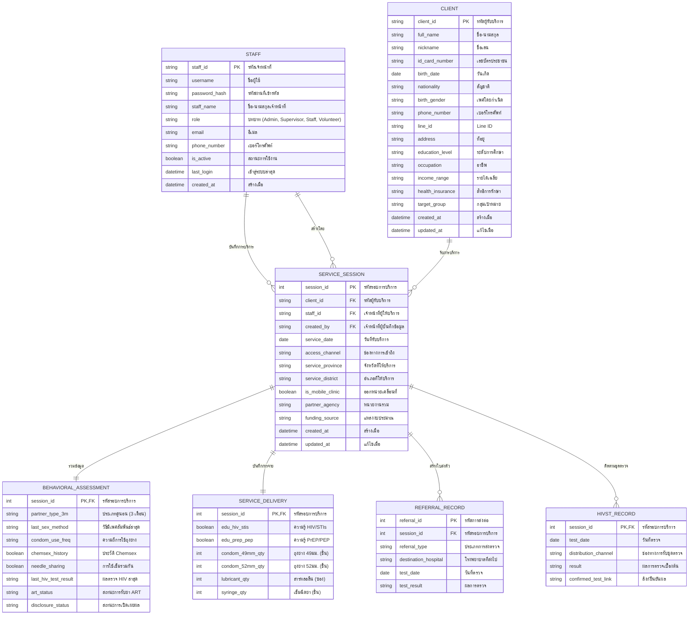

# แผนภาพความสัมพันธ์ของข้อมูล (ER Diagram) - ระบบ Diamond Friend

เอกสารนี้อธิบายโครงสร้างฐานข้อมูลที่ออกแบบมาเพื่อรองรับการทำงานของระบบจัดการข้อมูลผู้รับบริการ โดยอ้างอิงจาก "แบบฟอร์มเก็บข้อมูลผู้รับบริการ"

## แผนภาพ ER Diagram (Mermaid)

---

## รายละเอียดหน้าที่ของแต่ละตาราง (Entity Descriptions)

### 1. CLIENT (ตารางผู้รับบริการ)
*   **หน้าที่:** เก็บข้อมูลประวัติส่วนตัวและข้อมูลประชากรพื้นฐานของผู้รับบริการ
*   **ความสำคัญ:** เป็นตารางหลักที่ใช้ระบุตัวตน ข้อมูลในนี้มักจะไม่เปลี่ยนแปลงบ่อยครั้ง โดยใช้เลขบัตรประชาชนเพื่อป้องกันการลงข้อมูลซ้ำ

### 2. STAFF (ตารางเจ้าหน้าที่/ผู้ใช้งาน)
*   **หน้าที่:** เก็บข้อมูลเจ้าหน้าที่ทุกคนที่เข้าใช้งานระบบ รวมถึงการกำหนดบทบาท (Role)
*   **ความสำคัญ:** ใช้สำหรับการเข้าสู่ระบบ (Authentication) และการควบคุมสิทธิ์การเข้าถึงข้อมูล (Authorization) ตามระดับ Admin, Supervisor, Staff หรือ Volunteer

### 3. SERVICE_SESSION (ตารางรอบการรับบริการ)
*   **หน้าที่:** เป็นศูนย์กลางของการบันทึกข้อมูล ทุกครั้งที่ผู้รับบริการมาพบเจ้าหน้าที่ จะต้องมีการสร้าง "รอบการบริการ" ใหม่
*   **ความสำคัญ:** ทำหน้าที่เชื่อมโยงระหว่าง "ผู้รับบริการ" กับ "กิจกรรมต่างๆ" (เช่น การแจกของ หรือการประเมิน) ทำให้ทราบว่าการบริการนั้นเกิดขึ้นเมื่อไหร่ ที่ไหน และใครเป็นผู้ให้บริการ

### 4. BEHAVIORAL_ASSESSMENT (ตารางประเมินพฤติกรรมเสี่ยง)
*   **หน้าที่:** เก็บข้อมูลพฤติกรรมทางเพศและความเสี่ยงในช่วงเวลาที่กำหนด (เช่น 3 เดือน)
*   **ความสำคัญ:** เป็นข้อมูลที่มีความอ่อนไหวสูง ใช้สำหรับประเมินความเสี่ยงเพื่อจัดหาบริการที่เหมาะสมให้กับผู้รับบริการ

### 5. SERVICE_DELIVERY (ตารางบันทึกการจ่ายเวชภัณฑ์)
*   **หน้าที่:** บันทึกจำนวนวัสดุอุปกรณ์ป้องกัน (ถุงยางอนามัย, สารหล่อลื่น) และหัวข้อการให้ความรู้
*   **ความสำคัญ:** ใช้สำหรับการจัดการสต็อกและการสรุปยอดการแจกอุปกรณ์ตามแหล่งงบประมาณต่างๆ

### 6. REFERRAL_RECORD (ตารางบันทึกการส่งต่อ)
*   **หน้าที่:** ติดตามสถานะเมื่อมีการส่งตัวผู้รับบริการไปตรวจที่โรงพยาบาล
*   **ความสำคัญ:** ช่วยให้เจ้าหน้าที่สามารถติดตามผลการตรวจ (Referral Loop) ได้อย่างต่อเนื่อง ไม่ให้ข้อมูลขาดหาย

### 7. HIVST_RECORD (ตารางบันทึกชุดตรวจด้วยตนเอง)
*   **หน้าที่:** บันทึกข้อมูลเฉพาะสำหรับการแจกชุดตรวจ HIV แบบตรวจด้วยตนเอง (HIV Self-Test)
*   **ความสำคัญ:** ใช้ติดตามว่าผู้รับบริการนำชุดตรวจไปใช้จริงหรือไม่ และผลการตรวจเบื้องต้นเป็นอย่างไรเพื่อดำเนินการให้คำปรึกษาต่อไป
